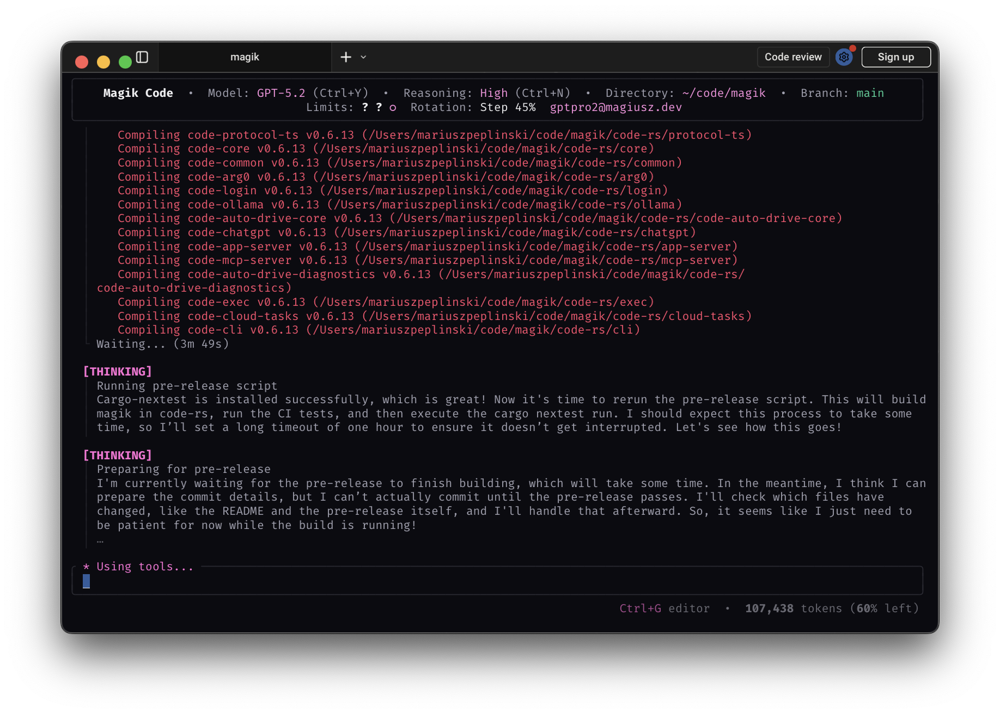

<pre><font color="#ff1493">
 ▄                 ▄▄ ▀▀ ▄▄         
 ███▄███▄ ▄▀▀█▄ ▄████ ██ ██ ▄█▀     
 ██ ██ ██ ▄█▀██ ██ ██ ██ ████       
▄██ ██ ▀█▄▀█▄██▄▀████▄██▄██ ▀█▄     
                   ██               
                 ▀▀▀                
</font></pre>

# Magik Code

Magik is a fast, local coding agent for your terminal.

This repository is a fork of **Every Code** (`just-every/code`) — and through that lineage, a fork of `openai/codex` — focused on improving day-to-day TUI ergonomics and customization.

## What’s different in Magik (vs Every Code)

- **Multi‑account overview + rotation strategies**: a clearer limits UI plus multiple rotation modes (Manual / On limit / Even usage / Step 45% / Reset‑based).
- **Better keyboard control**: dedicated shortcuts for model and reasoning changes (and separate toggles for reasoning vs “tool/explore” details).
- **Reasoning toggle ≠ tool‑details toggle**: full reasoning visibility is independent from the “explore details” view.
- **Clearly labeled blocks**: streamed output is presented in explicitly labeled sections (Answer / Reasoning / Tool calls, etc.).
- **More themes + easy theme editing**: lots of built‑ins and file‑backed themes stored in your Magik home so you can add/edit without recompiling.
- **Customizable “spinner verbs”**: customize status phrases (e.g. Thinking/Responding/Using tools) via `~/.magik/status_texts.json`.
- **UI polish**: optional rounded corners and other small layout/visual tweaks.

<p align="center">
  
</p>

&ensp;
## Quickstart (from source)

```bash
./build-fast.sh
./code-rs/bin/magik
```

### Install locally (recommended)

```bash
./scripts/install-magik-local.sh --build
magik --version
magik
```

&ensp;
## Commands

### Browser
```bash
# Connect Magik to external Chrome browser (running CDP)
/chrome        # Connect with auto-detect port
/chrome 9222   # Connect to specific port

# Switch to internal browser mode
/browser       # Use internal headless browser
/browser https://example.com  # Open URL in internal browser
```

### Agents
```bash
# Plan code changes (Claude, Gemini and GPT-5 consensus)
# All agents review task and create a consolidated plan
/plan "Stop the AI from ordering pizza at 3AM"

# Solve complex problems (Claude, Gemini and GPT-5 race)
# Fastest preferred (see https://arxiv.org/abs/2505.17813)
/solve "Why does deleting one user drop the whole database?"

# Write code! (Claude, Gemini and GPT-5 consensus)
# Creates multiple worktrees then implements the optimal solution
/code "Show dark mode when I feel cranky"
```

### Auto Drive
```bash
# Hand off a multi-step task; Auto Drive will coordinate agents and approvals
/auto "Refactor the auth flow and add device login"

# Resume or inspect an active Auto Drive run
/auto status
```

### General
```bash
# Try a new theme!
/theme

# Change reasoning level
/reasoning minimal|low|medium|high|xhigh

# Switch models or effort presets
/model

# Start new conversation
/new
```

### Keyboard shortcuts

- `Ctrl+Y` — switch session model
- `Ctrl+N` — cycle reasoning level for the current model (wraps)
- `Ctrl+R` — toggle reasoning visibility
- `Ctrl+E` — toggle “explore details” (tool-call details and other deep UI panels)
- `Ctrl+Shift+Y` — toggle mouse capture (helps with text selection)

The TUI header shows `Model` and `Reasoning` along with the `Ctrl+Y` / `Ctrl+N` hints, and the title reads `Magik Code`.

## CLI reference

```shell
magik [options] [prompt]

Options:
  --model <name>        Override the model for the active provider (e.g. gpt-5.1)
  --read-only          Prevent file modifications
  --no-approval        Skip approval prompts (use with caution)
  --config <key=val>   Override config values
  --oss                Use local open source models
  --sandbox <mode>     Set sandbox level (read-only, workspace-write, etc.)
  --help              Show help information
  --debug             Log API requests and responses to file
  --version           Show version number
```

Note: `--model` only changes the model name sent to the active provider. To use a different provider, set `model_provider` in `config.toml`. Providers must expose an OpenAI-compatible API (Chat Completions or Responses).

&ensp;
## Memory & project docs

Magik can remember context across sessions:

1. **Create an `AGENTS.md` or `CLAUDE.md` file** in your project root:
```markdown
# Project Context
This is a React TypeScript application with:
- Authentication via JWT
- PostgreSQL database
- Express.js backend

## Key files:
- `/src/auth/` - Authentication logic
- `/src/api/` - API client code  
- `/server/` - Backend services
```

2. **Session memory**: Magik maintains conversation history
3. **Codebase analysis**: Automatically understands project structure

&ensp;
## Non-interactive / CI mode

For automation and CI/CD:

```shell
# Run a specific task
magik --no-approval "run tests and fix any failures"

# Generate reports
magik --read-only "analyze code quality and generate report"

# Batch processing
magik --config output_format=json "list all TODO comments"
```

&ensp;
## Multi‑account usage & rotation

Magik supports multiple saved sign‑ins (ChatGPT auth and/or API keys) and can rotate between accounts based on rate-limit state.

- Manage accounts with `/login`.
- Inspect limits with `/limits` (use `refresh` or `refresh-all` to force re-checks).
- Configure rotation from `/settings` → `limits` (or `Ctrl+S` → Limits/Accounts), including:
  - **Manual**: never auto-switch.
  - **On limit**: only switch when the active account is limited.
  - **Even usage**: keep accounts within ~10% usage.
  - **Step 45%**: rotate when an account crosses 45% steps.
  - **Reset‑based**: prefer accounts with the soonest short-window reset.

&ensp;
## Model Context Protocol (MCP)

Magik supports MCP for extended capabilities:

- **File operations**: Advanced file system access
- **Database connections**: Query and modify databases
- **API integrations**: Connect to external services
- **Custom tools**: Build your own extensions

Configure MCP in `~/.magik/config.toml` (or `CODE_HOME/config.toml`) and define each server under a named table like `[mcp_servers.<name>]` (this maps to the JSON `mcpServers` object used by other clients):

```toml
[mcp_servers.filesystem]
command = "npx"
args = ["-y", "@modelcontextprotocol/server-filesystem", "/path/to/project"]
```

&ensp;
## Configuration

Main config file: `~/.magik/config.toml`

> [!NOTE]
> Magik defaults to `~/.magik/` for config/state. You can override that with `CODE_HOME` (or `CODEX_HOME`). For backwards compatibility, when no home override is set and a file is missing in `~/.magik/`, Magik may read the legacy `~/.magic/` or `~/.codex/` copy. Writes go to the resolved Magik home.

```toml
# Model settings
model = "gpt-5.1"
model_provider = "openai"

# Behavior
approval_policy = "on-request"  # untrusted | on-failure | on-request | never
model_reasoning_effort = "medium" # low | medium | high
sandbox_mode = "workspace-write"

# UI preferences
[tui.theme]
name = "light-photon"

[tui.spinner]
# Built-in name from the bundled spinners list (kebab-case), or a custom id.
name = "diamond"

# Optional: file-backed themes loaded at startup and shown in /theme.
# Create files in ~/.magik/themes/*.toml (or $CODE_HOME/themes/*.toml) with keys:
# id, name, description, is_dark, and [colors].

# Add config for specific models
[profiles.gpt-5]
model = "gpt-5.1"
model_provider = "openai"
approval_policy = "never"
model_reasoning_effort = "high"
model_reasoning_summary = "detailed"
```

### Environment variables

- `CODE_HOME`: Override config directory location
- `CODEX_HOME`: Legacy alias for overriding config directory location
- `OPENAI_API_KEY`: Use API key instead of ChatGPT auth
- `OPENAI_BASE_URL`: Use OpenAI-compatible API endpoints (chat or responses)
- `OPENAI_WIRE_API`: Force the built-in OpenAI provider to use `chat` or `responses` wiring

&ensp;
## Themes & status text

- **Built-in themes**: switch live via `/theme`.
- **File-backed themes**: drop `*.toml` into `~/.magik/themes/` (or `$CODE_HOME/themes/`) and they appear in `/theme`.
- **Custom “spinner verbs” / status phrases**: create `~/.magik/status_texts.json` to override the status text shown with the spinner. See `docs/magic-status-texts-and-spinners.md`.

&ensp;
## FAQ

**How is this different from the original?**
> Magik is a fork of Every Code and adds multi-account rotation strategies, more UI toggles/shortcuts, customizable status text, and additional theming/UI polish.

**Can I use my existing Codex configuration?**
> Yes. Magik uses `~/.magik/` by default and can still read legacy `~/.magic/` or `~/.codex/` files when the new location is missing data. New writes go to `~/.magik/` (or your `CODE_HOME`/`CODEX_HOME` override).

**Does this work with ChatGPT Plus?**
> Absolutely. Use the same "Sign in with ChatGPT" flow as the original.

**Is my data secure?**
> Yes. Authentication stays on your machine, and we don't proxy your credentials or conversations.

&ensp;
## Contributing

We welcome contributions! Magik aims to stay close to upstream behavior while adding quality-of-life improvements.

### Development workflow

If you haven't installed Rust yet, run `./scripts/bootstrap-local.sh` first.

```bash
# Build (use fast build for development)
./build-fast.sh

# Run locally
./code-rs/bin/magik
```

#### Git hooks

This repo ships shared hooks under `.githooks/`. To enable them locally:

```bash
git config core.hooksPath .githooks
```

The `pre-push` hook runs `./pre-release.sh` automatically when pushing to `main`.

### Opening a pull request

1. Fork the repository
2. Create a feature branch: `git checkout -b feature/amazing-feature`
3. Make your changes
4. Build successfully: `./build-fast.sh`
6. Submit a pull request


&ensp;
## Legal & Use

### License & attribution
- Magik is a fork of Every Code (`just-every/code`), which is a community fork of `openai/codex` under **Apache-2.0**.
- Magik is **not** affiliated with, sponsored by, or endorsed by OpenAI.

### Your responsibilities
Using OpenAI, Anthropic or Google services through Magik means you agree to **their Terms and policies**. In particular:
- **Don't** programmatically scrape/extract content outside intended flows.
- **Don't** bypass or interfere with rate limits, quotas, or safety mitigations.
- Use your **own** account; don't share or rotate accounts to evade limits.
- If you configure other model providers, you're responsible for their terms.

### Privacy
- Your auth file lives at `~/.magik/auth.json` by default (or under `CODE_HOME`/`CODEX_HOME`)
- Inputs/outputs you send to AI providers are handled under their Terms and Privacy Policy; consult those documents (and any org-level data-sharing settings).

### Subject to change
AI providers can change eligibility, limits, models, or authentication flows. Magik supports **both** ChatGPT sign-in and API-key modes so you can pick what fits (local/hobby vs CI/automation).

&ensp;
## License

Apache 2.0 - See [LICENSE](LICENSE) file for details.

Magik is a fork of Every Code and the original Codex CLI. It aims to stay compatible while adding developer-focused TUI ergonomics.
